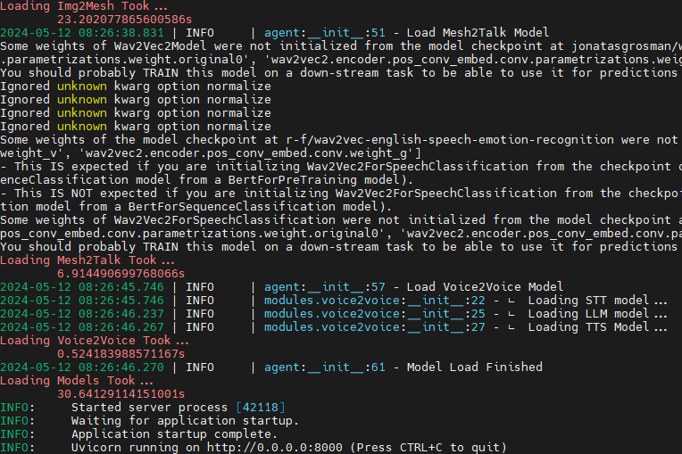
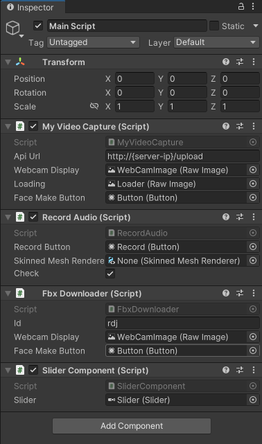
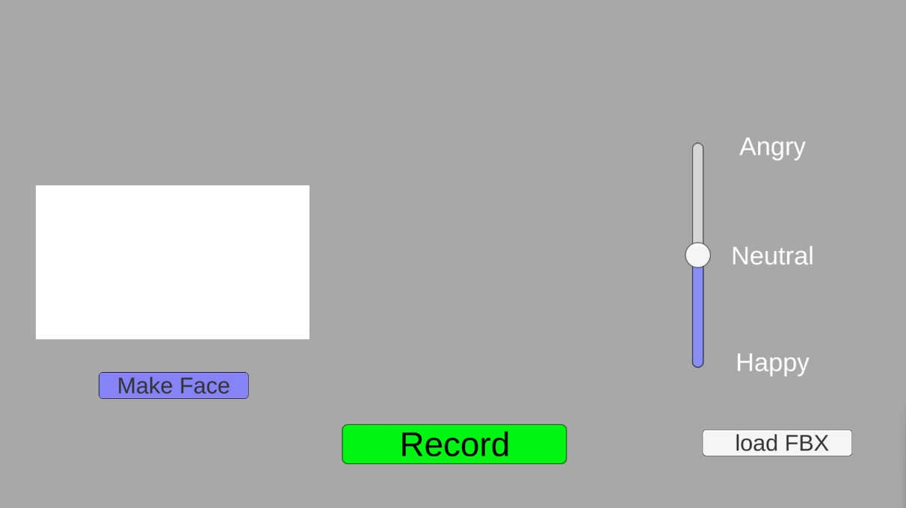

### Codes for audio driven 3D face generation

python version: 3.10.13

1. run install.sh file (Not verified yet, so check files and dependencies)
2. run download_weight.sh file
3. place keys.ini at ./talk_module/LLM/keys.ini  
    keys.ini 파일 형태  
    ```
    [OPENAI]  
    OPENAI_API_KEY=key
    ```
4. change line 438 of modelscope.models.cv.face_reconstruction.utils file

    original : os.path.join(save_dir, save_name + '.jpg'), mesh['texture_map']) 
    modified : os.path.join(save_dir, save_name + '.png'), mesh['texture_map'])

    also change line 449 of the same file 

    original : wf.write('map_Kd {}\n'.format(save_name + '.jpg'))
    modified : wf.write('map_Kd {}\n'.format(save_name + '.png'))

    since texturemap in pymeshlab only supports png files

### install lfs
curl -s https://packagecloud.io/install/repositories/github/git-lfs/script.deb.sh | sudo bash
sudo apt-get update
sudo apt-get install git-lfs
git lfs install
cd talk_module/EmotiVoice
git clone https://www.modelscope.cn/syq163/outputs.git
git clone https://www.modelscope.cn/syq163/WangZeJun.git

백엔드 서버 실행
```
uvicorn unity_api.main:app --host 0.0.0.0
```
서버 실행 성공시 이미지



  
  


---
## Unity
[다운로드 링크](https://drive.google.com/drive/folders/1bHYvi35AIMqvKqNAQv7O-TCWzR_NzCPS?usp=sharing)

MainScript 컴포넌트 내의 Api Url을 백엔드 서버 주소로 변경  



## Unity 실행화면

1. 웹캠 켠 후 Make face 버튼을 누르면 얼굴이 생성됩니다.(약 5분 소요)  
2. 얼굴 생성 후 Record 누르면 음성 녹음이 시작됩니다.  
3. 녹음이 끝나면 Stop 누르면 음성 응답이 생성됩니다.  

## load FBX
Main script의 FBX downloader id를 변경하여 이미 제작된 모델 임포트 가능  
서버의 data/result_fbx 내의 원하는 파일의 이름을 id로 지정하면 가져오기 가능